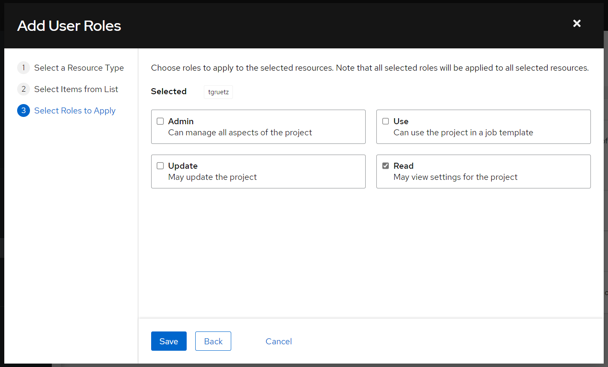
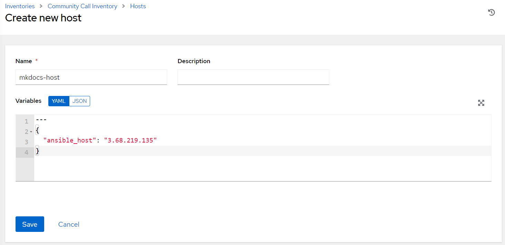
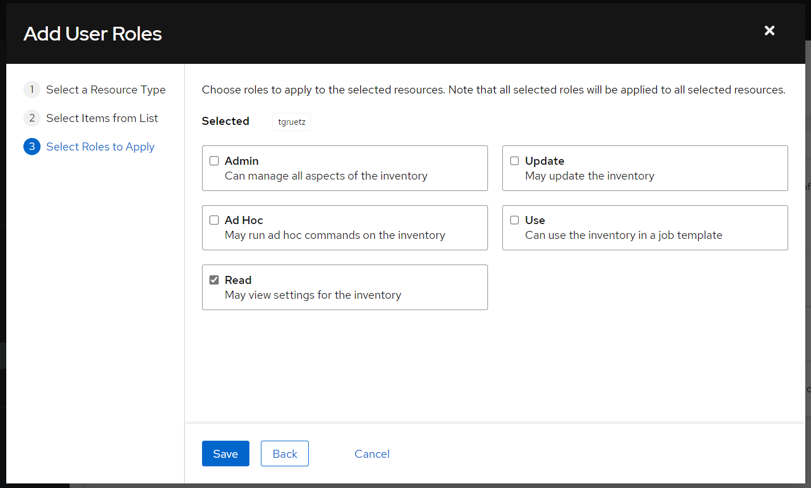
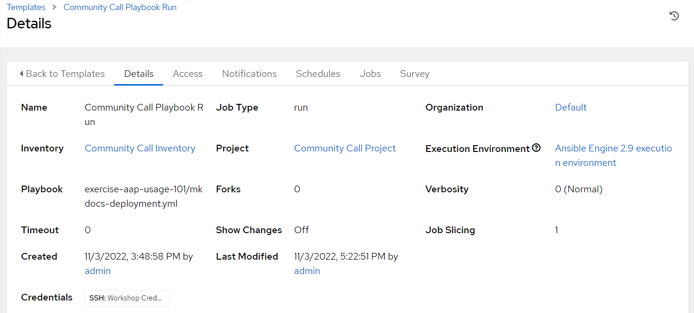
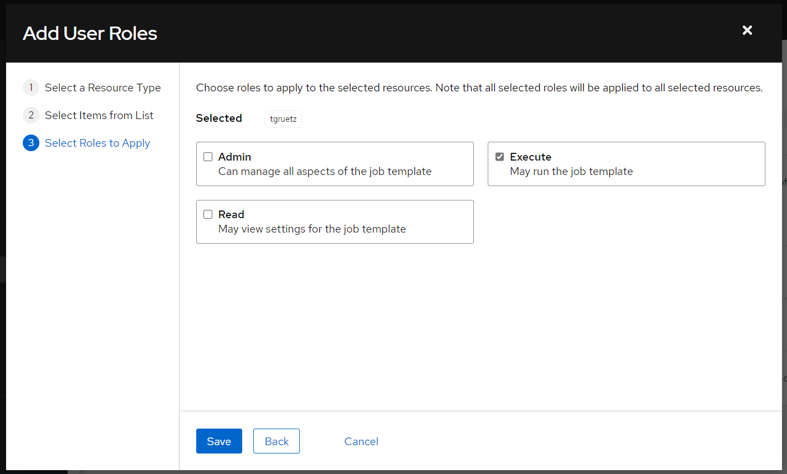

# AAP Usage 101

We will get to know the new Ansible Automation Platform and do some basic stuff.

## Create User

You will login as the `admin` user first, but we will also create a local user, who will only be able to run the job template which we will create during this session. Additionally, he won't have any permissions besides having *read* access to the *Project* or the *Inventory*. He won't be able to edit the job template either.

Go to *Users* and click the *Add* button:

| Parameter        | Value                                 |
| ---------------- | ------------------------------------- |
| **Username**     | *\<Your CC username>*                 |
| **Password**     | *\<Up to you, choose something easy>* |
| **User Type**    | *Normal User*                         |
| **Organization** | *Default*                             |

## Create project

Create a new *project* with the following parameters:

| Parameter                               | Value                                                                                                            |
| --------------------------------------- | ---------------------------------------------------------------------------------------------------------------- |
| **Name**                                | *Community Call Project*                                                                                         |
| **Organization**                        | *Default*                                                                                                        |
| **Source Control Type**                 | *Git*                                                                                                            |
| **Source Control URL**                  | [https://github.com/TimGrt/community-call-exercises.git](https://github.com/TimGrt/community-call-exercises.git) |
| **Options > Clean**                     | &#9745;                                                                                                          |
| **Options > Update Revision on Launch** | &#9745;                                                                                                          |


Ensure that the *Git Sync* is successful (*Details > Last Job Status > Successful*).

Add Access permissions to your project for your User, go to your project and select the *Access* tab, press the *Add* button. Your User should have **Read** permissions only!



## Create Inventory

Create a new *inventory* with the following parameters:

| Parameter        | Value                      |
| ---------------- | -------------------------- |
| **Name**         | *Community Call Inventory* |
| **Organization** | *Default*                  |

Add a new host to your inventory with the following parameters:

| Parameter     | Value                                                          |
| ------------- | -------------------------------------------------------------- |
| **Name**      | *mkdocs-host*                                                  |
| **Variables** | *ansible_host: \<IP address of node3 from Workshop inventory>* |

We will use the *node3* from the *Workshop inventory*, go to *Inventories > Workshop Inventory > Hosts > node3* and copy the variables section. Copy the YAML variable to *Inventories > Community Call Inventory > Hosts > mkdocs-host*.



> Do not copy this IP address, yours will be different!

Add Access permissions to the newly created inventory for your user. Your user should have **Read** permissions only.



## Create job template

Create a new *job template* with the following parameters:

| Parameter       | Value                                          |
| --------------- | ---------------------------------------------- |
| **Name**        | *Community Call Playbook Run*                  |
| **Job Type**    | *Run*                                          |
| **Inventory**   | *Community Call Inventory*                     |
| **Project**     | *Communtiy Call Project*                       |
| **Playbook**    | *exercise-aap-usage-101/mkdocs-deployment.yml* |
| **Credentials** | *Machine Credentials > Workshop Credentials*   |



Set permissions for the job template, your user should be able to **Execute** the template. If you would only set *Read* permissions, your user won't be able to do much...



All set, now the fun part begins.

## Log out and log in as you personal user

> If you are the `admin` user, log out and log in as your previously created user!

## Run the template

Are you logged in with your personal user?

**Launch the template...**

The playbook ran "successful", but nothing really happened, the play got skipped (*Could not match supplied host pattern*). Fix the error!

<p>
<details>
<summary><b>Help wanted?</b></summary>

Remember that every play always targets a group of hosts. Do we even defined a group in our inventory?

</details>
</p>

<p>
<details>
<summary><b>More help wanted?</b></summary>

The playbook targets the group `mkdocs`, create this group in your inventory (*Community Call Inventory*) and add `mkdocs-host` to that group. You will need to login as the *admin* user again, because you only have *read* permissions on the inventory.  
Log in as your personal user again and run the job template again.

</details>
</p>

**Launch the template again...**

Still an error, installing stuff fails (*This command has to be run under the root user.*). Well, this error should be easy to fix for you.

<p>
<details>
<summary><b>Help wanted?</b></summary>

We need *become* permissions, enable these for the job template.

</details>
</p>

Errors fixed? Your job template should run successfully, look at the last task and input the IP address into your browser.

**Let the discussion begin!**

## Bonus: Deploy the MkDocs project to one more node

Currently, we deployed the Webserver running the MkDocs project to `node3` (we called the host `mkdocs-host`). Add one more node (use `node2` of the *Workshop inventory*) to the *Community Call Inventory*, remember to provide the correct IP address with the `ansible_host` variable. Rename the existing host to `mkdocs-host1` and name the newly added host `mkdocs-host2`.  

Log in as your personal user again and run the template one more time.  
You should see the automated installation and configuration for two hosts (the first node with no changes). If you don't, take a look at the explanation below.
Awesome, now we could configure a loadbalancer, even if one of the webservers would fail, we could still access our content. But, let's save this task for another time...

The last task still only shows once, do you know why?

<p>
<details>
<summary><b>Solution and explanation.</b></summary>

The last task is shown only once because the task uses the `run_once` parameter, take a look at the `mkdocs-deployment.yml` playbook in the Git repository. The `run_once` parameter always runs on the first item in the *group*-list, the same as to use `mkdocs[0]` (every group is a list of hosts, the list is ordered).  
Does this make sense in our use case? Nope, we will never see the IP of the second host in the debug task...

If you don't see the automation happening on two nodes, make sure you activated the second node in your inventory. Did you add the host to the `mkdocs` group?  
If you did not create the group but instead renamed the host to `mkdocs` (this would work, the target only expects this string, if this string represents a node or a group isn't important for Ansible), your are in a tough spot right now. You would have to add the host to the play, e.g. like this:

```yaml
- name: Deploy Ansible Best Practices Guide with MkDocs
  hosts: mkdocs-host1,mkdocs-host2
  roles:
...    
```

This is not very useful, you would have the change your playbook every time a new host is added (renamed, deleted).  
It is Best-Practice to always target a group, even if your group only has one node in it. This way you would only have to change the inventory, but the *logic*/playbook can stay untouched.

</details>
</p>
