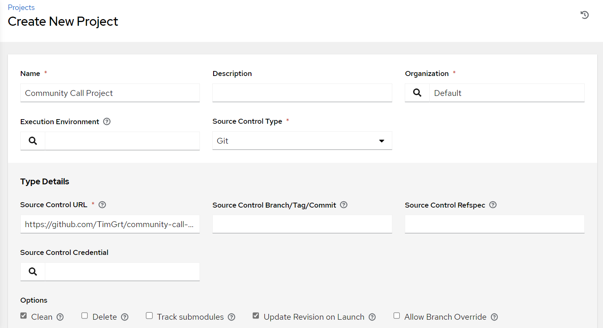

# AAP Usage 102

Some advanced features of AAP. We will be automating Cisco ACI, this requires a custom Execution Environment, a custom credential type and more.

## Additional Collection requirements

The playbook requires the Collections stated in the `requirements.yml`, ensure that the AAP can download collections during the project sync or add the following Execution Environment to AAP:

| Parameter        | Value                                                   |
| ---------------- | ------------------------------------------------------- |
| **Name**         | *Community Call EE*                                     |
| **Description**  | * EE with all dependencies for Community Call Exercise* |
| **Image**        | *docker.io/timgrt/community-call-ee:latest              |
| **Organization** | *Default*                                               |

## Create project

Create a new *project* with the following parameters:

| Parameter                               | Value                                                                                                            |
| --------------------------------------- | ---------------------------------------------------------------------------------------------------------------- |
| **Name**                                | *Community Call Exercises*                                                                                         |
| **Organization**                        | *Default*                                                                                                        |
| **Source Control Type**                 | *Git*                                                                                                            |
| **Source Control URL**                  | [https://github.com/TimGrt/community-call-exercises.git](https://github.com/TimGrt/community-call-exercises.git) |
| **Options > Clean**                     | &#9745;                                                                                                          |
| **Options > Update Revision on Launch** | &#9745;                                                                                                          |

Ensure that the *Git Sync* is successful (*Details > Last Job Status > Successful*).

## Create Inventory

Create a new *inventory* with the following parameters:

| Parameter        | Value                                |
| ---------------- | ------------------------------------ |
| **Name**         | *ACI Fabric*                         |
| **Description**  | *Inventory with source from project* |
| **Organization** | *Default*                            |

Add a new *inventory source* to your previously created inventory.  

The project your previously added contains an file `inventory.ini`, use this file as your source.

<b>Help wanted?</b>

Use *Sourced from a project*.

## Create a custom credential

Access to Cisco APIC requires an API hostname, username, password and a boolean value for certificate validation. Currently, no credential (type) is available for this, but you can create your own.  
Take a look at the [documentation for custom credential types](https://docs.redhat.com/en/documentation/red_hat_ansible_automation_platform/2.4/html/automation_controller_user_guide/assembly-controller-custom-credentials#proc-controller-create-credential-type) and create a new type called `Cisco ACI`.

Use the following values for all *input* fields:

| id                                 | label                    | type    | secret |
| ---------------------------------- | ------------------------ | ------- | ------ |
| **aci_api_endpoint**               | *ACI API endpoint*       | string  |        |
| **aci_username**                   | *ACI Username*           | string  |        |
| **aci_password**                   | *ACI Password*           | string  | true   |
| **aci_api_certificate_validation** | *Certificate validation* | boolean |        |

Use the following values for the *injector* configuration, they should be *injected* as *Environment variables* (as all `cisco.aci` modules can make use of these env variables):

| Environment Variable   | Value                                                     |
| ---------------------- | --------------------------------------------------------- |
| **ACI_HOST**           | `"{{ aci_api_endpoint }}"`                                |
| **ACI_USERNAME**       | `"{{ aci_username }}"`                                    |
| **ACI_PASSWORD**       | `"{{ aci_password }}"`                                    |
| **ACI_VALIDATE_CERTS** | `"{{ aci_api_certificate_validation \| default(true) }}"` |

## Create credential

Add a new credential using the previously created custom credential with the following parameters:

| Parameter                           | Value                                  |
| ----------------------------------- | -------------------------------------- |
| **Name**                            | *ACI Sandbox*                          |
| **Description**                     | *Credential for API Authentication*    |
| **Credential Type**                 | *Cisco ACI*                            |
| **Inputs > ACI API endpoint**       | *sandboxapicdc.cisco.com*              |
| **Inputs > ACI Username**           | *admin*                                |
| **Inputs > ACI Password**           | *!v3G@!4@Y*                            |
| **Inputs > Certificate validation** | *&#9745;*                              |
| **Organization**                    | *Default*                              |

## Create job template with survey

Create a new *job template* with the following parameters:

| Parameter       | Value                                          |
| --------------- | ---------------------------------------------- |
| **Name**        | *ACI automation*                                       |
| **Job Type**    | *Run*                                                  |
| **Inventory**   | *ACI Fabric*                                           |
| **Project**     | *Community Call Exercises*                             |
| **Playbook**    | *2023-12-12-exercise-aap-usage-102/aci-automation.yml* |
| **Credentials** | *ACI Sandbox*                                          |

Add a survey with the following question, remember to **enable** the survey!

| Parameter       | Value                                                        |
| --------------- | ------------------------------------------------------------ |
| **Question**    | *What is the name of the ACI tenant you want to create?*     |
| **Description** | *Playbook requires the Tenant name as an external variable.* |
| **Variable**    | *tenant_name*                                                |
| **Type**        | *text*                                                       |
| **Required**    | *true*                                                       |

Now, run the job template.
