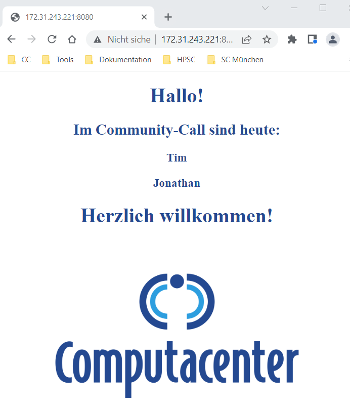

# Templates - Jinja2

This exercise will cover adjusting a template with the Jinja2 templating engine.  
It deploys a small *Python* webserver on your local machine with the template as the page shown. We use Python for the webserver as this is already present (you won't be able to use Ansible without Python). No sudo permissions are necessary (although you need to install a package before you can start), the webserver runs as your local user.

## Prerequisites

You need to install the *psutil* python package for the playbook to work. Depending on your system, this could be done like this:

```bash
sudo apt install python3-psutil
```

This command expects to run on a debian-based system with Python3. You may need to use another package manager. If you still use Python2, the package is also available (it is called `python-psutil`).

## Task 1

The playbook is almost complete, it misses the task to deploy the *index.html.j2*-Template from the `templates` folder.  
Choose an appropriate module the deploy the template, the destination depends on the directory from which the Python webserver is serving its content. Take a look at the task which starts the webserver to find out the root folder.  
The task and the complete playbook should run *idempotent*, it should not change anything if not needed.

## Tasks 2

The webserver *index.html* should greet all Community Call attendees (see the *results* heading below for the expected result). The logic for this is missing, the playbook offers a variable with a list of all attendees, every attendee (list member) should be shown on a separate line.  
Adjust the template (around line 33):

```jinja
<div class="center">
<div class="center-text">
  <p><h1>Hallo!</h1></p>
  <p><h2>Im Community-Call sind heute:</h2>
{# START #}
{# The template should use the variable 'attendee_list', every list member should be shown in a single line #}

{# Insert your logic here! #}

{# END #}
  <p><h1>Herzlich willkommen!</h1></p>
</div>
```

## Task 3 (Bonus)

Add a new functionality which stops (kills) the webserver when you provide a *tag*.  
The webserver should be stopped when you run the playbook like this:

```bash
ansible-playbook python-webserver-with-template.yml -t kill
```

The task to stop the webserver already exists, but it need to be adjusted with the tag. As the task uses a variable, you may need to modify more than one task...

## Task 4 (Bonus)

The playbook should use the *roles* structure.  
Create a new role, move the tasks and template into the role. The play should reference the role and execute normally.

## Result

If the template is filled correctly and the webserver is running (Port 8080), it shows the following page:



You can access your webserver by starting a browser and opening: `http://localhost:8080`.
You may have to use the IP address of your VM:

```bash
hostname -I
```

For example, the address would be: `http://172.31.243.221:8080`

If you want to stop the webserver manually, find out the process ID and kill the process:

```bash
ps aux | grep http.server
```
```bash
kill <process ID>
```
