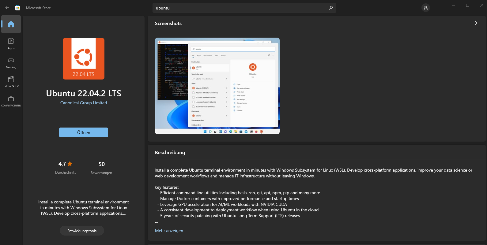

# Prepare WSL

To have a test environment for doing all exercises during the Community Call you can use *Windows Subsystem for Linx (WSL)*.

This guide shows you the basic steps to configure the *Ubuntu 22.04.02 LTS* WSL environment.



## Configuration

Execute the following steps.

> Disable the VPN when running WSL!

### Name resolution

By default, Internet connection is not working. You need to adjust the nameserver in `/etc/resolv.conf`. This file is a link, remove the link, we will create the file afterwards again.

```bash
sudo rm /etc/resolv.conf
```

Now, create (and open) the file with *vi*:

```bash
sudo vi /etc/resolv.conf
```

Input the following, remember to press *i* for entering *insert mode*:

```ini
nameserver 1.1.1.1
```

Press *escape* for leaving *insert mode*, write and leave the file with `:wq`.

### WSL configuration

In the last step we (re-)created the `resolv.conf`, by default, Windows will overwrite the file after every reboot. To prevent this, create the file `/etc/wsl.conf` and insert the following:

```ini
[network]
generateResolvConf = false
```

#### Enable systemd

To have WSL behave as a *normal* virtual machine, you can configure it to run *systemd*. This is very useful to test your Ansible content with Molecule and Docker!

Open `/etc/wsl.conf` and add a new section:

```ini
[network]
generateResolvConf = false

[boot]
systemd = true
```

Run the following command, which installs a necessary package:

```console
sudo apt install dbus-user-session
```

After doing the changes above, close the WSL window. Open **Powershell** and restart WSL:

```powershell
wsl.exe --shutdown
```

Open your Ubuntu WSL again and run the following command to ensure *systemd* is running:

```bash
systemctl list-unit-files --type=service
```

### Update packages

Ugrade all packages:

```bash
sudo apt update && sudo apt upgrade
```

### Install Python package manager

Install the Python3 package manager *pip3*:

```bash
sudo apt install python3-pip
```

### Install Ansible

Install Ansible (Core) via *pip3*, remember to put `--user`, otherwise installation may fail:

```bash
pip3 install ansible-core --user
```

Ansible is installed to `~/.local/bin`, this path is not yet added to the PATH environment variable. Run the following command:

```bash
source ~/.profile
```

### SSH Config for CCloud Gitlab

To be able to clone projects from the CCloud Gitlab, you need to adjust the *ssh_config* because the Gitlab instance is using a non-standard SSH port.

```bash
sudo vi /etc/ssh/ssh_config
```

At the end of the file, add the following block:

```ini
Host gitlab.ccloud.ninja
  User git
  Port 43700
  IdentityFile ~/.ssh/id_rsa
```

The config references your SSH private key, create it with:

```bash
ssh-keygen
```

Upload the public key to Gitlab, afterwards you should be able the clone via SSH.
